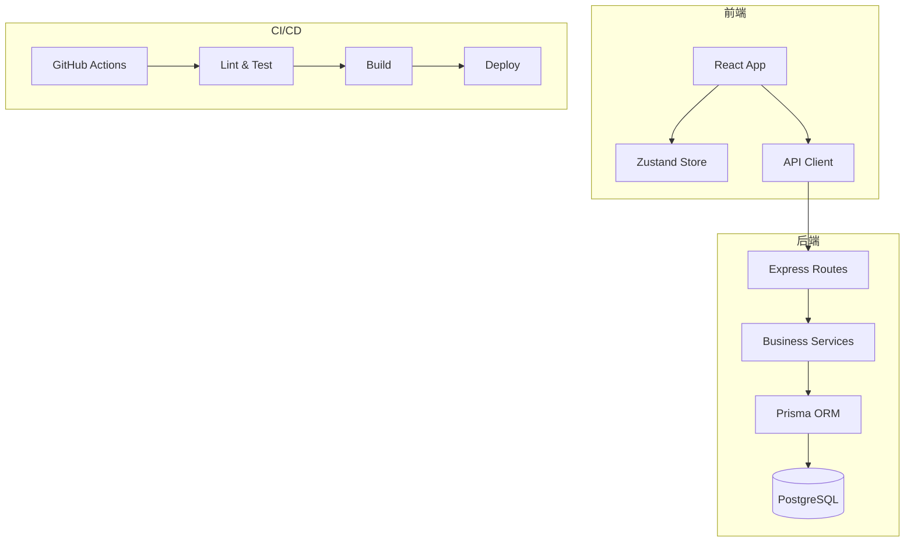

# 系统架构设计

> 由 Architect Agent 维护，所有 Agent 可读。

## 1. 概述

<!-- 描述项目的整体定位、核心功能和目标用户 -->

## 2. 系统架构图

## 3. 模块设计

### 3.1 前端模块

| 模块 | 职责 | 关键文件 |
|------|------|----------|
| 页面层 | 路由和页面布局 | `src/views/` |
| 组件层 | 可复用 UI 组件 | `src/components/` |
| 状态层 | 全局状态管理 | `src/stores/` |
| API 层 | 后端接口调用 | `src/api/` |

### 3.2 后端模块

| 模块 | 职责 | 关键文件 |
|------|------|----------|
| 路由层 | HTTP 端点定义 | `src/routes/` |
| 服务层 | 业务逻辑处理 | `src/services/` |
| 数据层 | 数据模型和访问 | `src/models/` |
| 中间件 | 认证、日志、错误处理 | `src/middleware/` |

## 4. 数据模型

<!-- 由 Architect Agent 根据需求设计 -->

## 5. 关键设计决策

| 决策 | 选择 | 理由 |
|------|------|------|
| <!-- 示例 --> | <!-- 选择 --> | <!-- 理由 --> |

## 6. 风险与缓解

| 风险 | 影响 | 缓解措施 |
|------|------|----------|
| <!-- 示例 --> | <!-- 高/中/低 --> | <!-- 措施 --> |
